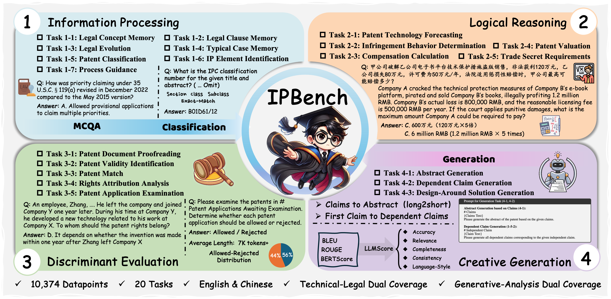
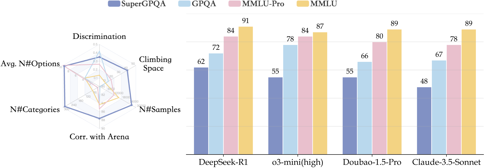








Hello, my name is Qiyao Wang (王琪尧). I am a first year Ph.D. student at the University of Chinese Academy of Sciences (UCAS), starting in Fall 2025, supervised by Prof. <a href="https://minyang.me/">Min Yang</a>. 
I obtained my Bachelor's degree in Artificial Intelligence from Dalian University of Technology (2021-2025).
During my undergraduate studies, I worked in the Dalian University of Technology <em>Information Retrieval Laboratory</em>
and <em>Public Service Science and Engineering Laboratory</em>, supervised by Prof. <a href="http://faculty.dlut.edu.cn/linyuan/zh_CN/index.htm">Yuan Lin</a>,
Prof. <a href="http://faculty.dlut.edu.cn/2004012069/en/index.htm">Kan Xu</a>
and Prof. <a href="https://faculty.dlut.edu.cn/linhongfei/zh_CN/index/789935/list/index.htm">Hongfei Lin</a>.

I warmly welcome undergraduates (any major) from DUT to join our research group for collaborative exploration. Please go thorough <a href="https://wangqiyao.me/lab">IP Intelligence Lab Homepage</a>. 
And if you are interested in my research, <strong style="color: darkred">feel free to collaborate with me</strong>!

As the project leader and supervisor, guided the entire undergraduate team to achieve 10 national-level awards and 12 provincial-level awards. 作为项目负责人和指导者，指导整个本科团队获得 10 项国家级奖项（包括2024年挑战杯国家银奖和2025年挑战杯国家级一等奖）和 12 项省级奖项。本科期间，发表《中文信息学报》(CCF-T1) 一作两篇，CSSCI期刊论文两篇（《图书情报工作》、《图书馆理论与实践》）。

博士生在读，发表 NeurIPS (CCF-A) 一篇.

<em><strong>Email</strong></em>: wangqiyao25@mails.ucas.ac.cn

Those who can imagine anything, can create the impossible. Sometimes it is the people who no one imagines anything of, that do the things that no one can imagine. —— Alan · Mathison · Turing

而世之奇伟、瑰怪，非常之观，常在于险远，而人之所罕至焉，故非有志者不能至也。 —— 游褒禅山记 · 临川先生

# 📌 Research Interests  

- ***General LLMs and MLLMs***: Exploring the underlying mechanisms of LLMs and MLLMs, and researching improved fine-tuning methods to enhance their understanding, reasoning, and generation capabilities.
  - ***Reinforcement Learning***: RL for LLMs Reasoning, Reward Modeling. [[Topic Homepage](https://wangqiyao.me/RL/)]
  - ***Multi-Modal LLMs***: [[MLLMs Topic Homepage](https://wangqiyao.me/MLLMs/)]
  - ***Information Retrieval (IR)***: Exploring improved <em>generative IR (GenIR)</em> approaches to enhance the capabilities of LLMs, and leveraging LLMs to improve IR performance.
- ***Agentic AI***: Developing general-purpose and code-oriented Agentic AI models through the synthesis of large-scale agentic datasets and the application of agentic reinforcement learning.
  - ***General Agentic AI***: [[Topic Homepage](https://wangqiyao.me/General-Agentic-AI/)]
  - ***Agentic Coding***: [[Topic Homepage](https://wangqiyao.me/Agentic-Coding/)]
- ***AI for Science and Social Science***: Developing domain-specific applications using LLMs and MLLMs to empower research in sciences and social sciences.
  - ***IP Intelligence***: Research on AI for IP service and IP of AI. [[Topic Homepage](https://wangqiyao.me/IPIntelligence/)] 
  - ***Law Intelligence***: LLMs for Law (there are some excellent works of SIAT-NLP, such as <a href="https://github.com/siat-nlp/HanFei">HanFei</a> and <a href="https://arxiv.org/abs/2408.08089">AgentCourt</a>)
  - ***Biomedical Intelligence***: AI for Biomedical.
 
# 🔥 News

<ul>
  <li><em><strong>2025.12.02:</strong></em> One <a href="https://kns.cnki.net/kcms2/article/abstract?v=dSUnQCB_TmPD5Vo4M5Z7pve-TNwni0aOM8xTQxBn92ZW4SwcjVu0H-I4LcD0yvSdizMLRdGYj4WBuKMRxhrErrC57hdXpKpawq-ZtygDhHQ4Mb5vl48xRfcsRpRtYNrhKRixZSuUptVPYGDluXKqtzZ2pRzYI5TVWcxA9ZNqOofYBsuwqyHduQ==&uniplatform=NZKPT&language=CHS">paper</a> published by <i>Library Theory and Practice</i> (CSSCI). </li>
  <li><em><strong>2025.11.03:</strong></em> &nbsp;🎉 As the Team Supervisor, I successfully guided my team to win the Third Prize at the national level in the 19th “Challenge Cup” National College Students’ Extracurricular Academic Science and Technology Competition! </li>
  <li><em><strong>2025.10.19:</strong></em> &nbsp;🎉 As the Team Supervisor, we have advanced to the on-site national finals of the 2025 Challenge Cup. See you in Nanjing on November 1st!</li>
  <li><em><strong>2025.07.30:</strong></em> &nbsp;🎉 As the Team Supervisor, I successfully guided my team to win the Third Prize at the national level in the 18th China College Students' Computer Design Competition.</li>
  <li>
    <em><strong>2025.06.14:</strong></em> &nbsp;🧠 My work <em>AutoPatent</em> was presented as a poster at the 
    <strong>Young Scholars Symposium on Natural Language Processing (YSSNLP) 2025, Dalian</strong>. Many thanks to the organizers for the opportunity!
  </li>
  <li><em><strong>2025.06.12:</strong></em> &nbsp;🎉 My undergraduate thesis titled "Research and Application of Large Language Models in the Intellectual Property Field" was awarded as an Outstanding Thesis (校优秀本科毕业论文) (<strong style="color:darkred;">Top 4.39%</strong>).</li>
  <li><em><strong>2025.03.03:</strong></em> &nbsp;🎉 As the leader of the Taibao-ip team, we provided DeepSeek model deployment services to the School of Public Administration at Dalian University of Technology, which was featured in reports by Guangming Daily and the school itself. 
[<a href="https://app2.gmdaily.cn/as/opened/n/88779004361149b8afb610ce04c162f6">News 1</a>] [<a href="https://mp.weixin.qq.com/s/yokeA5uiy1SxsbwmvCfiVQ">News 2</a>]
</li>
  <li><em><strong>2024.12.20:</strong></em> &nbsp;🎉 Our latest work, AutoPatent, has been reported by Xinzhiyuan and will continue to be expanded and improved in the future.[<a href="https://mp.weixin.qq.com/s/H6zsbruPl4wtYOFCOIphBA">News</a>]</li>
  <li><em><strong>2024.12.08:</strong></em> &nbsp;🎉 As the project leader, I successfully led my team to win the Third Prize at the national level in the 18th iCAN Innovation Contest.</li>
  <li><em><strong>2024.11.02:</strong></em> &nbsp;🎉 As the project leader, I successfully led my team to won second prize at the national level of the 14th “Challenge Cup” China College Students’ Entrepreneurship Competition.</li>
</ul>

# Manuscripts
<dl>
  <dt>
Preprint
</dt>
  <dd><strong>IPBench: Benchmarking the Knowledge of Large Language Models in Intellectual Property</strong></dd>
<dd><em><strong>Qiyao Wang</strong>, Guhong Chen, Hongbo Wang, Huaren Liu, Minghui Zhu, Zhifei Qin, Linwei Li, Yilin Yue, Shiqiang Wang, Jiayan Li, Yihang Wu, Ziqiang Liu, Longze Chen, Run Luo, Liyang Fan, Jiaming Li, Lei Zhang, Kan Xu, Chengming Li, Hamid Alinejad-Rokny, Shiwen Ni†, Yuan Lin†, Min Yang†</em>. CAS-SIAT and DUT.</dd>
<!-- <dd><a href="https://arxiv.org/abs/2504.15524">Arxiv: 2504.15524</a></dd> -->
<dd><a href="https://ipbench.wangqiyao.me">Website</a> | <a href="https://arxiv.org/abs/2504.15524">Paper</a> | <a href="https://huggingface.co/datasets/IPBench/IPBench">HuggingFace</a> | <a href="https://github.com/IPBench/IPBench">Github</a></dd>
<dd></dd>
</dl>

<dl>
<dt>
Preprint
</dt>
  <dd><strong>AutoPatent: A Multi-Agent Framework for Automatic Patent Generation</strong></dd>
<dd> <em><strong>Qiyao Wang*</strong>, Shiwen Ni*, Huaren Liu, Shule Lu, Guhong Chen, Xi Feng, Chi Wei, Qiang Qu, Hamid Alinejad-Rokny, and Yuan Lin†, Min Yang†</em>. CAS-SIAT and DUT.</dd>
<!-- <dd><a href="https://arxiv.org/abs/2504.15524">Arxiv: 2504.15524</a></dd> -->
<dd><a href="https://autopatent.wangqiyao.me/">Website</a> | <a href="https://arxiv.org/pdf/2412.09796">Paper</a> | <a href="https://huggingface.co/datasets/IPBench/IPBench">HuggingFace</a> | <a href="https://github.com/QiYao-Wang/AutoPatent">Github</a></dd>
<dd></dd>
</dl>

 

# Publications 
*Equal Contribution and † Corresponding Author

<strong>Spotlight Models</strong>

- Taibao(太保): Intellectual Property Service Large Language Model, published by <a href="https://spap.dlut.edu.cn/info/1123/4095.htm">School of Public Administration and Policy, DUT</a>, <a href="https://ir.dlut.edu.cn/">DUTIR Lab</a> and <a href="https://www.dlcipf.cn/">CNIPA-CIPF</a> (Leader)

<strong>2025 and Earlier</strong>

<dl>
  <dt>
NeurIPS 2025
</dt>
  <dd><strong>SuperGPQA: Scaling LLM Evaluation across 285 Graduate Disciplines</strong></dd>
<dd><em>M-A-P Team, Xinrun Du, et al., <strong>Qiyao Wang</strong> (Core Contributor listed in Alphabetical Order), et al., Ge Zhang</em>. M-A-P. <strong>NeurIPS 2025 (CCF-A)</strong></dd>
<!-- <dd><a href="https://arxiv.org/abs/2504.15524">Arxiv: 2504.15524</a></dd> -->
<dd><a href="https://supergpqa.github.io">Website</a> | <a href="https://arxiv.org/abs/2502.14739">Paper</a> | <a href="https://huggingface.co/datasets/m-a-p/SuperGPQA">HuggingFace</a> | <a href="https://github.com/SuperGPQA/SuperGPQA">Github</a></dd>
<dd></dd>
</dl>

 

  <ul>
    <li>
     IPEval: A Bilingual Intellectual Property Agency Consultation Evaluation Benchmark for Large Language Models. <em><strong>Qiyao Wang</strong>, Hongbo Wang, Jianguo Huang, Shule Lu, Yuan Lin†, Kan Xu, Liang Yang, Hongfei Lin.</em> DUT. 2024.
     [<a href="https://ipeval.wangqiyao.me/">Website</a>]
     [<a href="https://arxiv.org/pdf/2406.12386">Paper</a>]
     [<a href="https://huggingface.co/datasets/Mathsion/IPEval">HuggingFace</a>]
     [<a href="https://github.com/QiYao-Wang/IPEval">Github</a>]
     
    </li>
  </ul>

<strong>Survey</strong>

  <ul>
    <li>
     A Survey on Large Language Model Benchmarks. <em>Shiwen Ni, Guhong Chen, Shuaimin Li, Xuanang Chen, Siyi Li, Bingli Wang, <strong>Qiyao Wang</strong>, Xingjian Wang, Yifan Zhang, Liyang Fan, Chengming Li, Ruifeng Xu, Sun Le, Min Yang†</em>.
     [<a href="https://arxiv.org/abs/2508.15361">Paper</a>]
     [<a href="https://huggingface.co/papers/2508.15361">HuggingFace Paper</a>]
    </li>
  </ul>

<strong>Chinese Papers</strong>

  <ul>
    <li>
      大语言模型驱动知识产权服务智能体研究.
      <em>Yuan Lin†, Chenxi Xu, <strong>Qiyao Wang</strong> and Huaren Liu.</em> 2025. <strong>图书情报工作 (CSSCI, 北大核心, 南大核心)</strong>. DUT.
    </li>
    <li>
      CAGE: 基于协同增强相关反馈的查询扩展方法.
      <em><strong>Qiyao Wang</strong>, Hongbo Wang, Peiyu He, Yuan Lin†, Kan Xu and Hongfei Lin.</em> 2025. CCIR 2025. <strong>中文信息学报 (CCF-T1, CCF-B, 北大核心)</strong>. DUT.
    </li>
    <li>
      多智能体驱动的高校采购评审专家推荐研究.
      <em>Xinzhuo Wu, Rong Cao, Kan Xu, <strong>Qiyao Wang</strong>, Yuan Lin† and Hongfei Lin.</em> 2025. CCIR 2025. <strong>计算机工程与应用 (CCF-T2, CCF-C, 北大核心)</strong>. DUT.
    </li>
    <li>
      大语言模型赋能知识产权信息服务模型构建及应用.
      <em>Yuan Lin†, Chenxi Xu, <strong>Qiyao Wang</strong>, and Kun Ding.</em> 2025. <strong>图书馆理论与实践 (CSSCI扩展版, 北大核心)</strong>. DUT. [<a href="https://kns.cnki.net/kcms2/article/abstract?v=dSUnQCB_TmPD5Vo4M5Z7pve-TNwni0aOM8xTQxBn92ZW4SwcjVu0H-I4LcD0yvSdizMLRdGYj4WBuKMRxhrErrC57hdXpKpawq-ZtygDhHQ4Mb5vl48xRfcsRpRtYNrhKRixZSuUptVPYGDluXKqtzZ2pRzYI5TVWcxA9ZNqOofYBsuwqyHduQ==&uniplatform=NZKPT&language=CHS">Paper</a>]
    </li>
    <li>
      ECPE-Qwen: 微调大语言模型进行零样本情绪原因对抽取.
      <em><strong>Qiyao Wang</strong>, Liang Yang, Kan Xu, Yuan Lin† and Hongfei Lin.</em> 2024. CCIR 2024. <strong>中文信息学报 (CCF-T1, CCF-B, 北大核心)</strong>. DUT. [<a href="https://mp.weixin.qq.com/s/mkd7lqDpFGa0eLHYURoXGA">News</a>]
    </li>
  </ul>
  

# 🔧 Projects

<strong>Research Projects</strong>

  <ul>
    <li>大语言模型技术对知识产权数据开放和使用的影响研究：以专利为例. 国家知识产权战略实施研究基地专项研究. ZX250602. (Student Member)</li>
    <li>融合多源信息的学术推荐研究. 国家自然科学基金面上项目. 61976036. (Student Member)</li>
    <li>基于专利图谱和企业画像的专利推荐技术研究. 全国哲学社会科学工作办公室国家社科基金一般项目. 20BTQ074. (Student Member)</li>
  </ul>

<strong>College Students' Innovative Entrepreneurial Training Plan Program</strong>

Projects in Dalian University of Technology.

<ul>
<!--   <li>Policy Navigator: An AI-Powered Intelligent Policy Service Platform. <i>Hongbo Wang.</i> Supervisor: <i>Yuan Lin, <strong>Qiyao Wang</strong></i>. Not Assigned. 2024.12-2026.06 <i>(now)</i>. Supervisor. Ongoing.</li>
  <li>Wisdom Bridge - Empowering Collaborative Innovation in Government, Legal, and Technological Fields with Intelligent Intellectual Property Services. <i>Huaren Liu, Minghui Zhu, Boyu Ma, Yuhan Kang, Yueyi Ma.</i> Supervisor: <i>Yuan Lin, <strong>Qiyao Wang</strong></i>. Not Assigned. 2024.12-2026.06 <i>(now)</i>. Supervisor. Ongoing.</li>
  <li>AI Patent Agency for Intellectual Property Services. <i>Chenxing Li, Shiqiang Wang, Haoran Hu.</i> Supervisor: <i>Yuan Lin, <strong>Qiyao Wang</strong></i>. Not Assigned. 2024.12-2026.06 <i>(now)</i>. Supervisor. Ongoing.</li>
  <li>Research on Intellectual Property Examination Based on Large Language Models. <i>Xufeng Chen, Yanchao Jian.</i> Supervisor: <i>Yuan Lin, <strong>Qiyao Wang</strong></i>. Not Assigned. 2024.12-2026.06 <i>(now)</i>. Supervisor. Ongoing.</li> -->
  <li>Research on large language models for intellectual property public service. <i><strong>Qiyao Wang</strong>, Jianguo Huang, Shule Lu, Huaren Liu</i>. Supervisor: <i>Yuan Lin, Kan Xu</i>. National Level. 2023.09-2025.04. Leader. Completed.</li>
  <li>Research and application of technological gene based on representation learning. <i><strong>Qiyao Wang</strong>, Jiaxu Wu et.al.</i>. Supervisor: <i>Yuan Lin, Kan Xu</i>. School Level. 2022.12-2024.04. Leader. Completed.</li>
</ul>

# 🪡 Intellectual Property

<strong>Patents</strong>

- Method, Apparatus, Computer Device, and Storage Medium for Recommending Procurement Evaluation Experts in Universities. *Rong Cao, Xinzhuo Wu, Yuan Lin, **Qiyao Wang**, Kan Xu, Wenfei Liu, Hongbo Wang*. 202511277799.3. 2025.09.29. DUT. Pending. (Main Member)
- Method for Audio Transcription Annotation and Analysis Based on Multi-Agent Collaboration Mechanism. *Hongbo Wang, Yuan Lin, **Qiyao Wang**, Huanming Wang*. CN120492633A. 2025.05.30. DUT. Pending. (Main Member)
- Method, Apparatus, Electronic Device, and Storage Medium for Generating a Patent Application Document. *Shiwen Ni, Min Yang, **Qiyao Wang***. CN202411824533.1. 2024.12.12 CAS-SIAT. Pending. (Sole Student Member)
- A query expansion method based on collaborative enhancement at the term level. ***Qiyao Wang**, Shule Lu, Yang Yang, Yuan Lin et.al.*. CN118467708A. 2024.08.09. DUT. Licensed.
- A Technology Integration Opportunity Prediction Method Based on Large Language Models. ***Qiyao Wang**, Kan Xu, Shule Lu et.al.*. CN118246534A. 2024.06.25. DUT. Pending.

<strong>Software Copyrights</strong>

- Intelligent Patent Examination Assistance System. *Yanchao Jian, **Qiyao Wang**, Huaren Liu, Zhifei Qin, Hongbo Wang, Xufeng Chen, Kan Xu, Yuan Lin*. 2025SR1158441. 2025.07.03. DUT. Licensed. (Supervisor)
- IntelliPatent: Chinese Patent Document Generation System. *Chenxing Li, **Qiyao Wang**, Huaren Liu, Zhifei Qin, Shiqiang Wang, Haoran Hu, Hongbo Wang, Kan Xu, Yuan Lin*. 2025SR1158561. 2025.07.03. DUT. Licensed. (Supervisor)
- IntelliCode Document Assistant System. *Haoran Hu, **Qiyao Wang**, Hongbo Wang, Zhifei Qin, Huaren Liu, Shiqiang Wang, Chenxing Li, Kan Xu and Yuan Lin.* 2025SR0724402. 2025.05.06. DUT. Licensed. (Supervisor)
- Automated Patent Drafting System. *Rong Cao, **Qiyao Wang**, Huaren Liu, Zhifei Qin, Boyu Ma, Jingru Sun, Hongbo Wang, Kan Xu and Yuan Lin.* 2025SR0675652. 2025.04.24. DUT. Licensed. (Supervisor)
- Smart Technology Contract Generation System. *Shiqiang Wang, **Qiyao Wang**, Huaren Liu, Zhifei Qin, Hongbo Wang, Haoran Hu, Chenxing Li, Kan Xu and Yuan Lin*. 2025SR0674957. 2025.04.24. DUT. Licensed. (Supervisor)
- Multimodal Smart Home System. ***Qiyao Wang**, Yuan Lin et.al.*. 2024SR0971269. 2024.07.10. DUT. Licensed.
- Intellectual Property Intelligent Information Service Platform. ***Qiyao Wang**, Yuan Lin et.al.*. 2024SR0971263. 2024.07.10. DUT. Licensed.
- Technology Integration Opportunity Discovery System. ***Qiyao Wang**, Yuan Lin et.al.* 2024SR0681926. 2024.05.20. DUT. Licensed.

# 🎖 Honors and Awards

<strong>Academic Awards</strong>

- ***2025.08***: Outstanding Paper at the 2nd Annual Conference on Information Resource Management —— *Third Prize*. Yuan Lin, Chenxi Xu, Ya Zhang, ***Qiyao Wang***.
- ***2025.06***: Undergraduate thesis *Research and Application of Large Language Models in the Intellectual Property Field* —— ***Outstanding Thesis (校优秀本科毕业论文)*** (***Top 4.39%***)

<strong>Competition Awards</strong>

<strong>Bold text</strong> indicates national level.

- ***2025.11***: The 19th “Challenge Cup” National College Students’ Extracurricular Academic Science and Technology Competition —— ***First Prize*** at the National level. (Supervisor)
- ***2025.10***：The 11th Liaoning Province TRIZ Cup College Student Innovation Method Competition —— *First Prize* in Liaoning Province. (Supervisor)
- ***2025.08***：The 17th “Challenge Cup” Liaoning Province College Student Extracurricular Academic and Technological Works Competition —— *Grand Prize* in Liaoning Province. (Supervisor)
- ***2025.08***：The 13th China TRIZ Cup College Students' Innovation Method Competition —— ***Second Prize*** at the National level. (Supervisor)
- ***2025.08***：The 2025 China International College Students Innovation Competition **($\times 2$)** —— *Silver Prize* in Liaoning Province. (Supervisor)
- ***2025.07***：The 18th China College Students' Computer Design Competition —— ***Third Prize*** at the National level. (Supervisor)
- ***2025.06***: 2025 University Computer Competition, Internet Technology Challenge **($\times 2$)** —— *Third Prize* in Northeast Regional. (Supervisor)
- ***2025.06***: The 12th College Students Innovation and Entrepreneurship Annual Meeting —— *Second Prize* in Liaoning Province. (Leader)
- ***2025.05***: The 18th China College Students' Computer Design Competition —— *First Prize* in Liaoning Province. (Supervisor)
- ***2024.12***: The 18th iCAN Innovation Contest —— ***Third Prize*** at the National level. (Leader)
- ***2024.11***: The 14th "Challenge Cup" College Students' Entrepreneurship Plan Competition —— ***Second Prize*** at the National level. (Leader)
- ***2024.10***: The 18th iCAN Innovation Contest —— *Second Prize* in Liaoning Province. (Supervisor)
- ***2024.09***: 2024 University Computer Competition, Internet Technology Challenge —— ***Third Prize*** at the National level. (Leader)
- ***2024.09***: The 12th China TRIZ Cup College Students' Innovation Method Competition —— ***Second Prize*** at the National level. (Leader)
- ***2024.08***: The 2024 China International College Students Innovation Competition —— *Gold Prize* in Liaoning Province. (Leader)
- ***2024.07***: The 14th "Challenge Cup" College Students' Entrepreneurship Plan Competition —— *Grand Prize* in Liaoning Province. (Leader)
- ***2024.07***: The 17th China College Students' Computer Design Competition —— ***Second Prize*** at the National level. (Leader)
- ***2023.06***: The 18th "Challenge Cup" College Students' Extracurricular Academic Science and Technology Works Competition —— *Grand Prize* in Liaoning Province. (Main Member)
- ***2023.03***: U.S. National College Mathematics Competition —— ***Honorable Prize*** at the National level. (Leader)
- ***2022.11***: The 14th National College Students' Mathematics Competition —— ***First Prize*** at the National level. (Single Member)

# 📖 Educations
- ***2025.09 - (5 years)***, pursuing a Ph.D. degree in Computer Technology, ShenZhen Institute of Advanced Technology, Chinese Academy of Science, China.
- ***2021.09 - 2025.06***, Bachelor degree in AI, School of Future Technology, Dalian University of Technology, China.
  
# 💬 Academe Service

<strong>Talks</strong>

- ***2024.12.09***: 大连理工大学厚德书院科创座谈会. <a href="https://mp.weixin.qq.com/s/fuMAmP7zYZMMlxLAlxJx0w">Link</a>
- ***2024.11.20***: 大连理工大学“挑战杯“经验分享会. <a href="https://mp.weixin.qq.com/s/r1-7V-a5C7FR-fPE6hJNQQ">Link</a>

# 💻 Internships
- ***2025.10 - (now)***: Tongyi Lab, Alibaba, Beijing
- ***2022.12 - 2025.09***: DUTIR, Dalian

  

Updated at November, 2025. 

